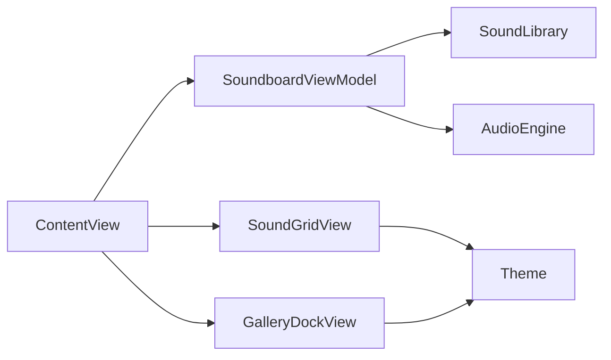

# soundbook

An iOS **sound library** app: pick a themed library (e.g. Forest, City), then tap large rounded tiles to hear sounds. The UI is illustration-first and low on text; tiles use gradient placeholders until final artwork ships. Only **one sound plays at a time** (tap again to stop).

Design reference: [`Sources/interfaceDesign.jpg`](Sources/interfaceDesign.jpg).

## Features

- **Library selector** at the bottom switches between curated libraries and their sound sets.
- **Sound grid** of rounded tiles with varied sizes; active tile is highlighted.
- **Exclusive playback** via `AVAudioPlayer`: starting a new sound stops the previous one.
- **Accessibility**: tiles expose labels derived from sound names for VoiceOver.
- **SwiftPM + app target**: reusable `SoundbookCore` library and a thin `SoundbookApp` shell with bundle ID and `Info.plist`.

Add **`.mp3` (or other) files** to the app bundle matching the `fileName` values in [`Sources/SoundbookCore/SoundLibrary/SoundLibrary.swift`](Sources/SoundbookCore/SoundLibrary/SoundLibrary.swift) to hear real audio; missing files fail safely without crashing.

## Tech stack

- **Language**: Swift 5.9+
- **UI**: SwiftUI
- **Audio**: AVFoundation (`AVAudioSession`, `AVAudioPlayer`)
- **Modules**: Swift Package `SoundbookCore` ([`Package.swift`](Package.swift)) + Xcode app target **SoundbookApp**

## Project layout

| Path | Role |
|------|------|
| [`SoundbookApp/`](SoundbookApp/) | `@main` app entry, `Info.plist`, bundle ID |
| [`Soundbook.xcodeproj/`](Soundbook.xcodeproj/) | Xcode project and shared scheme |
| [`Sources/SoundbookCore/`](Sources/SoundbookCore/) | Audio engine, sound catalog, theme, SwiftUI views and view model |
| [`Package.swift`](Package.swift) | Declares the `SoundbookCore` library for SwiftPM |

## Getting started

### Requirements

- iOS 14.0+
- Xcode 15+ (recommended; Swift tools version 5.9)

### Installation

```bash
git clone https://github.com/gkarasek/soundbook.git
cd soundbook
open Soundbook.xcodeproj
```

### Build and run

1. Select the **SoundbookApp** scheme (not a standalone Swift package executable).
2. Choose an iPhone simulator or device.
3. Press **Cmd + R** to build and run.

The UI and logic live in **SoundbookCore**; **SoundbookApp** is a thin shell with a real `Info.plist` and bundle ID (`com.gkarasek.soundbook`), which avoids simulator issues from a missing `CFBundleIdentifier`.

To open only the package (e.g. for SwiftPM tooling): `open Package.swift`.

## Architecture



- **ContentView**: Full-screen dark layout, sound tile grid, bottom library dock.
- **SoundboardViewModel**: Selected library, press-to-play, URL resolution for bundle audio.
- **SoundLibrary**: In-memory `SoundLibraryModel` / `SoundItem` definitions per library.
- **AudioEngine**: Foreground effects with fade, looping background ambience.
- **Theme**: Shared colors, gradients, and animation constants.

## Roadmap / ideas

Possible future directions (not implemented today):

- Persistence for custom libraries (e.g. Core Data / files)
- Per-sound volume, mixing multiple layers, or looping policies
- Replace gradient tiles with bundled illustration assets per sound and library

## Contributing

Contributions are welcome. Please open pull requests against `main`.

## License

MIT License

## Contact

Created by [@gkarasek](https://github.com/gkarasek)
