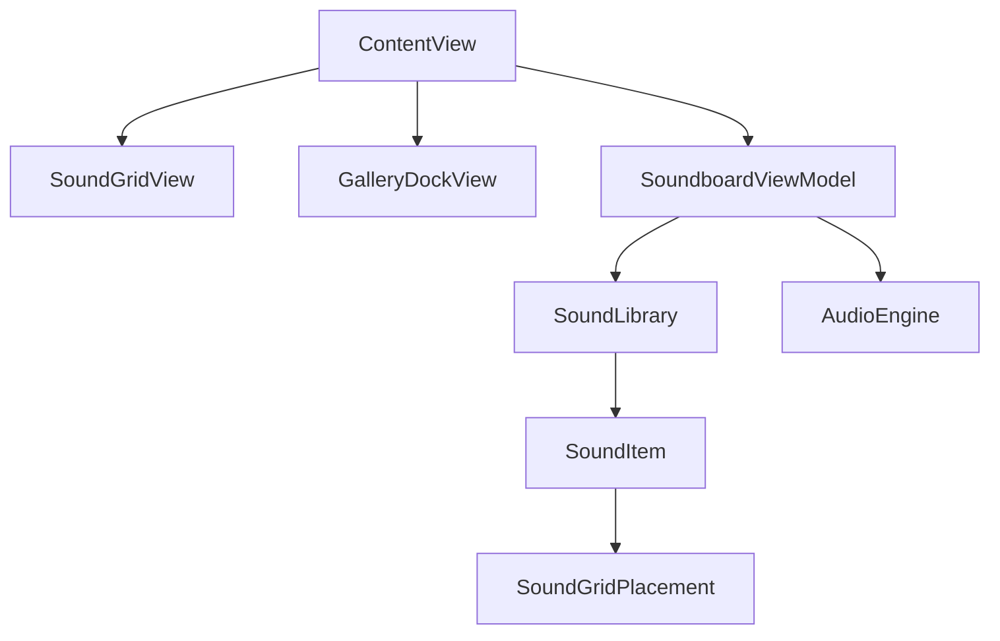

# soundbook

An iOS **sound library** app: pick a themed gallery from the dock (Forest, City, Ocean, Desert), then tap tiles in a proportional sound grid to hear sounds. The UI is illustration-first and low on text; tiles use gradient placeholders until final artwork ships. Only **one sound plays at a time** (tap again to stop).

Design reference: Figma [`Soundbook_Grid`](https://www.figma.com/design/Y4GTAaZeVukxaHyciLnj2A/Soundbook?node-id=41-2) frame (also see [`Sources/interfaceDesign.jpg`](Sources/interfaceDesign.jpg)).

## Features

- **Gallery dock** — horizontally scrollable pill selector at the bottom; tap an idle gallery to select it, with spring-animated width/border transitions (160pt idle → 240pt selected) and scroll-into-view so the active pill stays fully visible inside the dock.
- **Proportional 7×12 sound grid** — each gallery has its own tile layout; the grid scales to device width with square cells (8pt gaps) and a locked **7:12** width-to-height ratio. Square spans render as circles; wider tiles use a fixed 48pt corner radius.
- **Four galleries** — Forest and City use distinct Figma-inspired layouts (7 sounds each); Ocean and Desert are stub galleries (6 sounds each) with placeholder audio filenames until dedicated assets ship.
- **Exclusive playback** via `AVAudioPlayer`: starting a new sound stops the previous one; tapping the active tile stops it. Switching galleries also stops playback and crossfades the grid.
- **Active tile feedback** — playing sound shows a green stroke border on the tile; idle tiles use a subtle white stroke.
- **Accessibility**: dock pills and tiles expose labels for VoiceOver; the selected gallery is marked as selected.
- **SwiftUI previews** — `#Preview` blocks on `ContentView`, `SoundGridView`, and `GalleryDockView` for Xcode Canvas development.
- **SwiftPM + app target**: reusable `SoundbookCore` library and a thin `SoundbookApp` shell with bundle ID and `Info.plist`.

Add **`.mp3` (or other) files** to the app bundle matching the `fileName` values in [`Sources/SoundbookCore/SoundLibrary/SoundLibrary.swift`](Sources/SoundbookCore/SoundLibrary/SoundLibrary.swift) to hear real audio; missing files fail safely without crashing.

## Tech stack

- **Language**: Swift 5.9+
- **UI**: SwiftUI (iOS 14+; custom grid layout without `Grid` API)
- **Audio**: AVFoundation (`AVAudioSession`, `AVAudioPlayer`)
- **Modules**: Swift Package `SoundbookCore` ([`Package.swift`](Package.swift)) + Xcode app target **SoundbookApp**

## Project layout

| Path | Role |
|------|------|
| [`SoundbookApp/`](SoundbookApp/) | `@main` app entry, `Info.plist`, bundle ID |
| [`Soundbook.xcodeproj/`](Soundbook.xcodeproj/) | Xcode project and shared scheme |
| [`Sources/SoundbookCore/UI/Views/ContentView.swift`](Sources/SoundbookCore/UI/Views/ContentView.swift) | Root screen: content area + gallery dock |
| [`Sources/SoundbookCore/UI/Views/SoundGridView.swift`](Sources/SoundbookCore/UI/Views/SoundGridView.swift) | 7×12 proportional grid and sound tile buttons |
| [`Sources/SoundbookCore/UI/Views/GalleryDockView.swift`](Sources/SoundbookCore/UI/Views/GalleryDockView.swift) | Horizontal gallery dock with selected/idle pills |
| [`Sources/SoundbookCore/SoundLibrary/SoundLibrary.swift`](Sources/SoundbookCore/SoundLibrary/SoundLibrary.swift) | Gallery catalog, `SoundGridPlacement`, `SoundTileVisualStyle`, sound definitions |
| [`Sources/SoundbookCore/UI/ViewModels/BookSessionViewModel.swift`](Sources/SoundbookCore/UI/ViewModels/BookSessionViewModel.swift) | `SoundboardViewModel` (gallery selection, playback state, tap handling) |
| [`Sources/SoundbookCore/AudioEngine/AudioEngine.swift`](Sources/SoundbookCore/AudioEngine/AudioEngine.swift) | Exclusive `AVAudioPlayer` playback |
| [`Sources/SoundbookCore/`](Sources/SoundbookCore/) | Remaining models and legacy session views |
| [`Package.swift`](Package.swift) | Declares the `SoundbookCore` library for SwiftPM |

## Getting started

### Requirements

- iOS 14.0+
- Xcode 15+ (recommended; Swift tools version 5.9)

### Installation

```bash
git clone https://github.com/gkarasek/soundbook.git
cd soundbook
open Soundbook.xcodeproj
```

### Build and run

1. Select the **SoundbookApp** scheme (not a standalone Swift package executable).
2. Choose an iPhone simulator or device.
3. Press **Cmd + R** to build and run.

The UI and logic live in **SoundbookCore**; **SoundbookApp** is a thin shell with a real `Info.plist` and bundle ID (`com.gkarasek.soundbook`), which avoids simulator issues from a missing `CFBundleIdentifier`.

To open only the package (e.g. for SwiftPM tooling): `open Package.swift`.

## Architecture



- **ContentView**: Full-screen dark gradient; bottom-aligned sound grid and gallery dock. Gallery changes animate the grid with opacity + scale.
- **SoundGridView**: Places tiles on a 7×12 grid from each sound’s `SoundGridPlacement` (column, row, columnSpan, rowSpan). Cell size is derived from available width; height follows the 7:12 aspect ratio.
- **GalleryDockView**: Scrollable dock; selected pill (teal gradient, green border, per-gallery accent overlay) vs idle pill (solid orange, subtle stroke).
- **SoundboardViewModel**: Selected gallery, visible sounds (sorted by grid position), active sound ID, tap-to-toggle, bundle URL resolution. Stops playback when the gallery changes.
- **SoundLibrary**: In-memory `SoundLibraryModel` / `SoundItem` definitions per gallery; `SoundTileVisualStyle` keys map to gradient placeholders until illustration assets ship.
- **AudioEngine**: Single active player; `playExclusive` / `stopCurrent` for exclusive playback. Missing bundle files fail safely without crashing.

Legacy **reading session** types (`BookSession`, `BookSessionViewModel`, optional session screens) remain in the package for reference but are not used by the root app flow.

## Roadmap / ideas

Possible future directions (not implemented today):

- Sync ambient sounds with audiobook narration or reading position
- Persistence for sessions or custom galleries (e.g. Core Data / files)
- Per-sound volume, mixing multiple layers, or looping policies
- Replace gradient tiles with bundled illustration assets per sound and gallery
- Dedicated audio files and final layouts for Ocean and Desert galleries

## Contributing

Contributions are welcome. Please open pull requests against `main`.

## License

MIT License

## Contact

Created by [@gkarasek](https://github.com/gkarasek)
